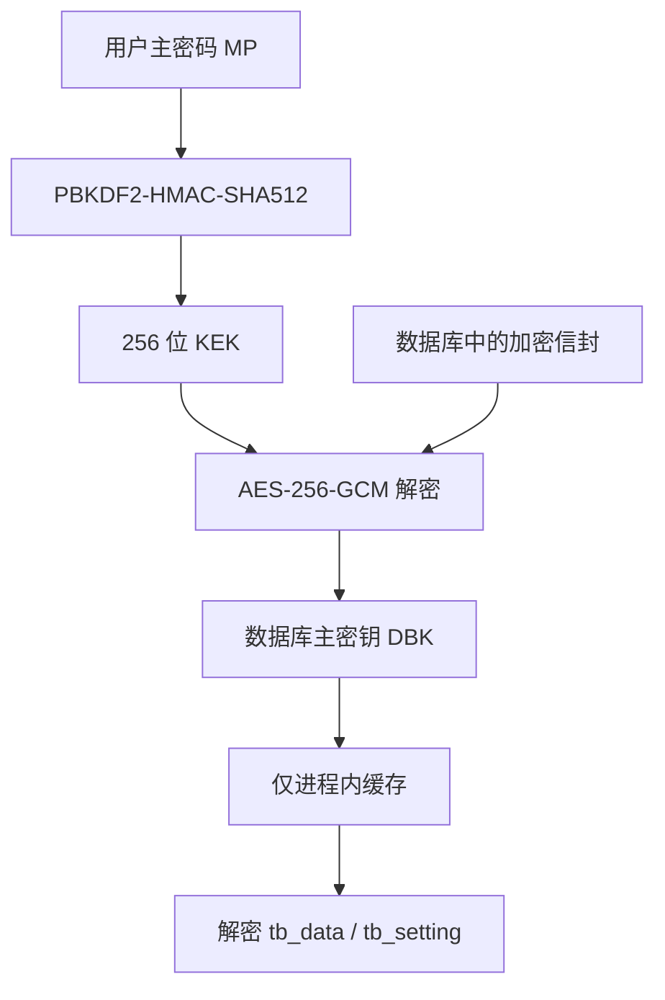
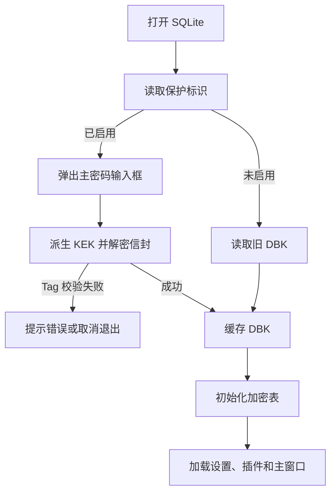

# Termora 2.x 数据库主密钥保护修改设计

## 1. 文档信息

- 目标仓库：`TermoraDev/termora`
- 基线分支：`2.x`
- 基线提交：`a3c283150951bedc094e57651beba6bd0bc6bb55`
- 文档目的：在不改变现有业务数据加密方式的前提下，增加用户主密码（Master Password）保护，避免数据库加密主密钥继续以明文保存在 `termora.db` 中。

## 2. 结论与推荐方案

本次修改应明确区分三个概念：

| 名称 | 英文缩写 | 含义 | 是否持久化 |
|---|---|---|---|
| 用户主密码 | MP | 用户在设置界面输入的 Master Password | 永不持久化 |
| 密钥加密密钥 | KEK | 由 MP 通过慢速 KDF 派生出的 256 位 AES 密钥 | 永不持久化 |
| 数据库主密钥 | DBK | 当前 `DatabaseSecret.password + salt` 组成的数据库加密秘密 | 启用保护后只保存密文 |

推荐的总体方案：

1. 用户在“设置 → 安全”中启用“主密码保护”。
2. 使用 PBKDF2-HMAC-SHA512 从用户主密码派生 256 位 KEK。
3. 使用 AES-256-GCM 和每次随机生成的 12 字节 nonce，加密现有数据库主密钥包。
4. 数据库只保存版本化的加密信封 `DatabaseSecretEnvelope`，不保存用户主密码、KEK 或明文 DBK。
5. 软件启动时先读取未加密的保护标识；启用保护时弹窗要求用户输入主密码。
6. 解密成功后，仅在进程内缓存 DBK；后续数据库访问不再重复询问主密码。
7. 同步时同步保护标识和加密后的 DBK 信封，绝不上传用户主密码、KEK 或明文 DBK。
8. 为避免不同设备现有数据库密钥不同，云端采用“每设备密钥槽”结构，而不是直接用一台设备的 DBK 覆盖其他设备。



## 3. 当前代码现状

当前代码的关键流程如下：

1. `DatabaseManager` 打开 `${Application.getBaseDataDir()}/config/termora.db`。
2. `DatabaseSecret` 从未加密表 `tb_unsafe_setting` 读取：
   - `__DB_PASSWORD`
   - `__DB_SALT`
3. `DataEntity.data` 和 `SettingEntity.value` 使用 `Algorithms.AES_256_PBE_GCM(password, salt)`。
4. `HostManager` 将包含 SSH 密码、代理密码的完整 `Host` 序列化为 JSON，再写入 `DataEntity.data`。

当前主要风险是：密文和用于派生数据库加密密钥的 `password/salt` 位于同一个 SQLite 文件中。只要获得完整 `termora.db`，就同时获得了解密材料。

当前代码还有两个与本次修改直接相关的约束：

- `DataEntity`、`SettingEntity` 是 Kotlin `object`，其加密转换器在对象第一次初始化时绑定 `DatabaseSecret`。因此必须在首次引用这两个对象之前完成解锁。
- `ApplicationRunner.run()` 当前先启动插件加载线程，再打开数据库，可能产生插件抢先访问数据库的竞态。增加主密码保护后，应先完成数据库 bootstrap 和解锁，再启动插件线程。

## 4. 功能范围

### 4.1 必须实现

- 设置界面新增“安全 / 主密码保护”选项。
- 支持启用、修改、关闭主密码保护。
- MP 不写入数据库、配置文件、日志、同步数据或崩溃报告。
- 启用保护后，明文 DBK 不再保存于数据库。
- 启动时依据数据库标识决定是否提示输入 MP。
- 解锁成功后缓存 DBK，进程生命周期内不再提示。
- DBK 使用 AES-256-GCM 加密。
- 同步保护状态和加密后的设备 DBK 信封。
- 兼容未启用保护的旧数据库。
- 错误密码、信封损坏、同步冲突必须失败关闭，不能静默生成新 DBK。

### 4.2 不在首版范围

- Windows DPAPI、macOS Keychain、Linux Secret Service 自动解锁。
- 生物识别解锁。
- 忘记主密码后的数据恢复后门。
- 运行一段时间后自动锁定。

这些能力可在后续版本中以新的信封类型扩展。

## 5. 密码学设计

### 5.1 KDF

首版建议复用 JDK 自带算法，避免新增本地依赖：

- 算法：`PBKDF2WithHmacSHA512`
- 随机 salt：32 字节
- 迭代次数：220,000
- 输出长度：256 bit
- 主密码输入：`CharArray`

参数必须写入信封，不能硬编码在解密逻辑中，以便未来提高迭代次数或迁移到 Argon2id。

主密码处理要求：

- 不调用 `trim()`，空格属于密码的一部分。
- 不保存为长期存在的 Kotlin/Java `String`。
- 对确认框做恒定语义比较后尽快清零 `CharArray`。
- 派生完成后清零 KEK 临时字节数组。
- 建议最少 12 个字符，并允许长口令；不要强制复杂字符组合。

### 5.2 AES-256-GCM

- Transformation：`AES/GCM/NoPadding`
- Key：32 字节 KEK
- Nonce：12 字节，由 `SecureRandom` 每次重新生成
- Tag：128 bit，由 JCE 附加在 ciphertext 尾部
- AAD：`Termora|DatabaseSecretEnvelope|v1|<keyId>|<deviceId>`
- 编码：Base64

严禁从 `deviceId`、`keyId`、时间戳或固定字符串派生 nonce；同一个 KEK 下每次加密都必须使用新的随机 nonce。

### 5.3 被加密内容

为兼容现有 `Algorithms.AES_256_PBE_GCM(password, salt)`，首版不更换数据库列的底层密钥体系，而是加密整个现有秘密包：

```json
{
  "password": "现有 __DB_PASSWORD",
  "salt": "现有 __DB_SALT"
}
```

启用、修改主密码时不重新加密 `tb_data` 和 `tb_setting`。只有 DBK 的外层包装发生变化，业务数据密文保持不变。

## 6. 本地数据库格式

继续使用 `tb_unsafe_setting`，无需新增 SQLite 表。建议增加以下名称：

| name | value | 说明 |
|---|---|---|
| `__DB_PROTECTION_ENABLED` | `0` / `1` | 启动阶段可直接读取的保护标识 |
| `__DB_PROTECTION_ENVELOPE` | JSON | 当前设备 DBK 的 AES-GCM 信封 |
| `__DB_DEVICE_ID` | UUID | 数据库/设备密钥槽标识，不是秘密 |
| `__DB_PASSWORD` | 明文或固定哨兵 | 未保护时为旧值；保护时为 `!TERMORA_PROTECTED_V1!` |
| `__DB_SALT` | 旧 salt | 可保留；salt 本身不是秘密 |

保护信封建议结构：

```kotlin
@Serializable
data class DatabaseSecretEnvelope(
    val schemaVersion: Int = 1,
    val keyId: String,
    val deviceId: String,
    val kdf: KdfParams,
    val cipher: CipherParams,
    val ciphertext: String,
    val revision: Long,
    val updatedAt: Long,
)

@Serializable
data class KdfParams(
    val algorithm: String = "PBKDF2WithHmacSHA512",
    val salt: String,
    val iterations: Int = 220_000,
    val keyLength: Int = 256,
)

@Serializable
data class CipherParams(
    val algorithm: String = "AES/GCM/NoPadding",
    val nonce: String,
    val tagLength: Int = 128,
)
```

保留 `__DB_PASSWORD` 哨兵而不是删除该记录，是为了让旧版本 Termora 降级启动时失败关闭。否则旧版本发现 `__DB_PASSWORD` 不存在后会自动生成新值，容易把“受保护数据库”误判为新数据库。

启用保护后，数据库中不得出现真实 `__DB_PASSWORD`；哨兵值不能被任何新代码当成密码使用。

## 7. 启动与解锁流程

推荐将数据库初始化拆成两个阶段：

1. Bootstrap：只连接 SQLite、创建/读取 `UnsafeSettingEntity`。
2. Unlock：取得 DBK 后，再初始化 `DataEntity`、`SettingEntity` 和其他服务。



启动规则：

- `enabled=0`：按旧方式读取 DBK。
- `enabled=1`：只允许从信封解密 DBK；不得退回旧字段或自动生成新密钥。
- 标识存在但信封缺失/损坏：显示明确的数据库保护损坏错误并退出。
- 用户取消：安全关闭数据库并退出，不启动后台同步、插件或主窗口。
- 密码错误：AES-GCM tag 校验失败，统一显示“主密码错误或密钥数据已损坏”，不要区分细节。
- 解锁成功：只缓存 `DatabaseSecretPayload`，不缓存 MP 或 KEK。
- `DatabaseSecret` 应有显式状态：`UNINITIALIZED / LOCKED / UNLOCKED / FAILED`。

必须调整 `ApplicationRunner.run()` 顺序：

```text
打印系统信息
→ 数据库 bootstrap
→ 如有需要弹出解锁窗口
→ 初始化 DataEntity / SettingEntity
→ 加载设置与主题
→ 启动插件加载线程
→ 启动同步和主窗口
```

## 8. 设置界面

建议新增 `SecurityOption`，标题为“安全”，位置放在“外观”之后、“账户”之前。

界面内容：

- 状态：未启用 / 已启用。
- “启用主密码保护”按钮。
- “修改主密码”按钮。
- “关闭主密码保护”按钮。
- 安全提示：忘记主密码后无法恢复本地密码、私钥及其他加密数据。
- 若已登录云账户：提示主密码设置会同步到同一账户的其他设备。

### 8.1 启用

1. 输入 MP 和确认 MP。
2. 生成 KDF salt、nonce、`keyId`。
3. 加密当前 DBK。
4. 立即使用新信封做一次解密自检。
5. 在单个 SQLite transaction 中：
   - 写入信封；
   - 写入 `enabled=1`；
   - 将 `__DB_PASSWORD` 替换为哨兵；
   - 保留或更新 `__DB_SALT`；
   - 写入 `deviceId`。
6. transaction 成功后触发安全信封同步。
7. 清零 MP、KEK 和临时明文缓冲。

### 8.2 修改

- 要求重新输入当前 MP，即使本进程已经解锁。
- 解密旧信封并确认 DBK 与内存缓存一致。
- 使用新的 KDF salt、nonce 和 MP 重新包装相同 DBK。
- `keyId` 保持不变，`revision + 1`。
- 不重写 `tb_data`、`tb_setting`。
- 有云同步时，需要先拉取最新安全记录，再对所有已知设备槽统一重新包装；离线修改必须明确提示可能产生同步冲突。

### 8.3 关闭

- 要求重新输入当前 MP。
- 明确警告关闭后 DBK 将重新以明文保存在本地数据库。
- 在单个 transaction 中恢复 `__DB_PASSWORD/__DB_SALT`，写入 `enabled=0`，删除本地信封。
- 云端绝不上传明文 DBK；只同步 `enabled=false` 和安全信封删除标记。
- 其他设备收到远端关闭标识时不能静默降低本地安全性，必须由用户在该设备上确认。

## 9. 同步设计

### 9.1 为什么不能直接同步一个 DBK

每个现有 `termora.db` 都有自己生成的 `__DB_PASSWORD/__DB_SALT`。如果设备 A 将 DBK 同步给设备 B，而设备 B 已经有用本地 DBK 加密的数据，直接替换后设备 B 的 `tb_data` 和 `tb_setting` 将无法解密。

因此首版推荐同步“每设备加密密钥槽”：

```kotlin
@Serializable
data class MasterKeySyncRecord(
    val schemaVersion: Int = 1,
    val enabled: Boolean,
    val revision: Long,
    val updatedAt: Long,
    val slots: Map<String, DatabaseSecretEnvelope>, // deviceId -> envelope
)
```

特点：

- 每台已有设备继续使用自己的 DBK，不需要整库重加密。
- 每个 DBK 都使用相同用户 MP 派生的 KEK 体系保护，但每个槽有独立随机 KDF salt 和 nonce。
- 新设备在登录后发现远端 `enabled=true`，必须提示输入 MP；验证成功后，将自己的本地 DBK 包装成新槽并上传。
- 从数据库备份恢复时，`deviceId` 与本地信封跟随数据库一起恢复。
- 删除设备时可从云端记录中删除对应槽。

### 9.2 接入现有同步框架

建议增加：

- `DataType.DatabaseSecretEnvelope`
- 稳定 objectId：`SHA-256("Termora|DatabaseSecretEnvelope|" + accountId)` 的前 32 个十六进制字符
- `ownerId`：当前用户账户 ID
- `ownerType`：`User`
- 禁止作为 Team 数据同步

现有 `/v1/data/push` 和 `/v1/data/{id}` 是通用数据接口。若服务端不限制 `type` 枚举，可直接复用；否则服务端需要允许新的数据类型。

本地早期启动必须读取 `tb_unsafe_setting` 中的本设备信封，因此不能只把该记录保存在 `DataEntity`。增加 `MasterKeySyncService` 负责在以下两份表示之间同步：

- 本地启动副本：`tb_unsafe_setting`
- 云端同步副本：`MasterKeySyncRecord`

### 9.3 同步应用规则

- 本地启用、修改、关闭保护后，立即标记安全记录待同步。
- 启动解锁不依赖网络；本地信封永远是当前设备启动的直接来源。
- 远端 `enabled=true` 且本地未启用：提示用户输入远端 MP，验证后包装本地 DBK并启用。
- 远端 `enabled=false` 且本地已启用：只提示，不自动关闭。
- 远端缺少当前 `deviceId` 槽：使用当前已验证 MP 创建并追加本地槽。
- 远端槽 revision 高于本地：下次启动使用新信封，或立即要求输入新 MP 后替换。
- 同一 revision 内容不同：视为冲突，停止安全记录自动合并并提示用户。
- 修改 MP 时需要重新包装全部槽；不能只更新当前设备槽，否则不同设备会使用不同 MP。
- MP、KEK、解密后的 DBK 不得出现在同步请求、日志或异常文本中。

### 9.4 修复现有同步 AES-GCM nonce 复用

当前 `SyncService.encryptData()` 使用 `SHA-256(objectId)` 前 12 字节作为固定 IV。同一对象多次更新时，会在相同账户密钥下重复使用 GCM nonce。

本次增加安全记录同步时，建议同时引入同步密文 v2：

```text
v2:<Base64(randomNonce[12] || ciphertextAndTag)>
```

- `encryptData()` 每次生成新的随机 12 字节 nonce。
- `decryptData()` 优先识别 `v2:`。
- 没有 `v2:` 前缀时按旧的固定 IV 逻辑解密，保持向后兼容。
- 所有新写入一律使用 v2。

如果暂时不修复全局同步格式，安全信封内层仍必须使用独立随机 nonce；但不建议继续扩大旧同步格式的使用范围。

## 10. 建议的代码改动

### 10.1 新增文件

| 文件 | 作用 |
|---|---|
| `src/main/kotlin/app/termora/database/DatabaseSecretEnvelope.kt` | 信封、KDF、cipher 参数模型 |
| `src/main/kotlin/app/termora/database/DatabaseSecretCrypto.kt` | KDF、AES-GCM、AAD 和清零逻辑 |
| `src/main/kotlin/app/termora/database/DatabaseSecretRepository.kt` | 只访问 `UnsafeSettingEntity` 的 bootstrap 仓库 |
| `src/main/kotlin/app/termora/security/MasterPasswordUnlockDialog.kt` | 启动解锁窗口 |
| `src/main/kotlin/app/termora/security/MasterPasswordSetupDialog.kt` | 启用/修改/关闭确认窗口 |
| `src/main/kotlin/app/termora/security/SecurityOption.kt` | 设置页 |
| `src/main/kotlin/app/termora/account/MasterKeySyncService.kt` | 安全记录同步及设备槽合并 |

### 10.2 修改文件

| 文件 | 主要修改 |
|---|---|
| `Crypto.kt` | 给 AES-GCM 增加 AAD 重载；保留现有接口兼容调用方 |
| `database/DatabaseSecret.kt` | 改为显式状态机；支持 legacy、unlock、enable、change、disable |
| `database/DatabaseManager.kt` | 拆分 bootstrap/unlock/full-init；确保解锁先于加密表初始化 |
| `database/UnsafeSettingEntity.kt` | 表结构可不变；集中定义新的 name 常量 |
| `database/DataType.kt` | 增加 `DatabaseSecretEnvelope` |
| `ApplicationRunner.kt` | 调整启动顺序；处理取消、错误密码和损坏信封 |
| `SettingsOptionsPane.kt` | 注册 `SecurityOption`，或通过 `SettingsOptionExtension` 注册 |
| `account/SyncService.kt` | 新增随机 nonce 的同步密文 v2 和旧格式回读 |
| `account/PushService.kt` | 推送安全记录，处理版本冲突 |
| `account/PullService.kt` | 安全记录优先处理，不允许远端静默降低本地保护 |
| `resources/i18n/messages*.properties` | 增加安全设置、解锁、错误和恢复提示 |

## 11. 关键接口建议

```kotlin
interface MasterPasswordProvider {
    fun request(reason: UnlockReason): CharArray?
}

class DatabaseSecret {
    fun bootstrap()
    fun requiresUnlock(): Boolean
    fun unlock(masterPassword: CharArray): UnlockResult
    fun enable(masterPassword: CharArray)
    fun change(oldPassword: CharArray, newPassword: CharArray)
    fun disable(masterPassword: CharArray)
    fun requireUnlocked(): DatabaseSecretPayload
    fun state(): DatabaseSecretState
}

enum class UnlockResult {
    SUCCESS,
    WRONG_PASSWORD_OR_CORRUPT,
    UNSUPPORTED_FORMAT,
}
```

`DataEntity` 和 `SettingEntity` 只能在 `DatabaseSecret.state == UNLOCKED` 后初始化。建议在 `DatabaseSecret.getInstance().requireUnlocked()` 中进行硬性检查，而不是依赖调用顺序约定。

## 12. 原子性与失败恢复

- 启用、修改和关闭操作必须使用 SQLite transaction。
- 新信封写入后必须先在内存中解密自检，再提交 transaction。
- 不允许“先删除明文 DBK，再写信封”的非原子顺序。
- 任何失败都保持旧状态可用。
- 写入失败后不能修改内存状态。
- 启用保护前建议复制 `termora.db` 为带时间戳的本地备份；备份文件权限应仅允许当前用户访问。
- 日志只记录状态和错误类型，不记录 MP、KEK、DBK、信封明文、完整 ciphertext。
- 若信封损坏，不得自动生成新 DBK。

## 13. 兼容性与升级

### 13.1 旧数据库升级

- 首次启动新版本时保持 `enabled=0`，行为与旧版本一致。
- 只有用户主动启用后才移除明文 DBK。
- 不自动要求所有用户设置 MP。

### 13.2 版本降级

- 启用保护后禁止无提示降级。
- `__DB_PASSWORD` 使用哨兵避免旧版重新生成 DBK。
- 文档和 UI 必须提示：启用后旧版本无法读取该数据库。

### 13.3 信封版本升级

- 所有信封携带 `schemaVersion`、KDF 参数和 cipher 参数。
- 未知版本必须返回 `UNSUPPORTED_FORMAT`，不能猜测参数。
- 后续迁移 Argon2id 时新增 schema 或 KDF 名称，不覆盖旧解析器。

## 14. 测试计划

### 14.1 单元测试

- 正确 MP 可完成加密/解密 round-trip。
- 错误 MP 解密失败。
- 修改 ciphertext、nonce、AAD、tag 任一字节均失败。
- 连续两次包装相同 DBK，nonce 和 ciphertext 不同。
- KDF 参数可从信封读取并正确派生。
- MP `CharArray` 和 KEK 临时数组在 finally 中被清零。
- 哨兵不会被当作 legacy DBK。
- 未知 schema/KDF/cipher 明确失败。

### 14.2 数据库集成测试

- 旧数据库启动不提示 MP，数据保持可读。
- 启用后 SQL dump 中找不到真实 `__DB_PASSWORD`。
- 启用后重启必须提示 MP。
- 成功输入一次后，同一进程访问多个 Host 不重复提示。
- 错误密码不初始化 `DataEntity/SettingEntity`。
- 用户取消后不启动插件和同步线程。
- 修改 MP 后旧 MP 失败，新 MP 成功，业务数据无需重写。
- 关闭保护后旧版本路径仍能读取。
- 模拟 transaction 中途异常，旧状态仍然可启动。

### 14.3 同步测试

- 设备 A 启用后上传 `enabled=true` 和 A 槽密文。
- 设备 B 拉取后提示 MP，验证成功并追加 B 槽。
- 云端和本地均不存在明文 MP/KEK/DBK。
- 修改 MP 后全部设备槽 revision 一致。
- 设备收到远端关闭标识时不会自动关闭本地保护。
- 并发修改产生冲突时停止自动覆盖。
- 同步 v2 每次更新使用不同 nonce。
- 旧 v1 同步数据仍可读取，新写入升级为 v2。

### 14.4 安全测试

- 搜索 `termora.db`、日志、线程名、异常信息，确认不包含 MP。
- 使用 SQLite 工具验证启用后的 DBK 仅以 AES-GCM ciphertext 存在。
- 验证文件复制攻击：仅获得数据库且不知道 MP 时无法恢复 DBK。
- 验证篡改攻击：修改保护标识或信封不能触发 legacy fallback。
- 验证高频错误输入不会造成无限制快速离线尝试；KDF 达到预期耗时。

## 15. 实施顺序

1. 实现信封模型、KDF、AES-GCM、AAD 和单元测试。
2. 重构 `DatabaseSecret/DatabaseManager` 为 bootstrap + unlock 两阶段。
3. 调整 `ApplicationRunner`，确保数据库解锁先于插件和同步线程。
4. 完成启用、修改、关闭的事务逻辑。
5. 增加安全设置页和启动解锁窗口。
6. 增加同步安全记录和每设备密钥槽。
7. 将现有同步 AES-GCM 升级到随机 nonce v2。
8. 完成升级、降级、损坏信封、跨设备和冲突测试。

## 16. 验收标准

- 启用保护后，`termora.db` 中不存在可直接用于解密业务数据的明文 DBK。
- MP 和 KEK 从不持久化或同步。
- AES-GCM 使用 256 位密钥、随机 12 字节 nonce、128 位 tag。
- 启动必须先解锁，再初始化加密表、插件和同步服务。
- 输入一次正确 MP 后，本次运行不再询问。
- MP 修改不触发业务表重加密。
- 同步只包含保护标识和加密信封；禁用时也不上传明文 DBK。
- 现有未保护数据库无损升级。
- 错误密码、元数据缺失、密文损坏、未知版本均失败关闭。
- 多设备不会因互相覆盖 DBK 而造成已有本地数据库不可读。

## 17. 代码参考

- [DatabaseSecret.kt](https://github.com/TermoraDev/termora/blob/a3c283150951bedc094e57651beba6bd0bc6bb55/src/main/kotlin/app/termora/database/DatabaseSecret.kt)
- [DatabaseManager.kt](https://github.com/TermoraDev/termora/blob/a3c283150951bedc094e57651beba6bd0bc6bb55/src/main/kotlin/app/termora/database/DatabaseManager.kt)
- [DataEntity.kt](https://github.com/TermoraDev/termora/blob/a3c283150951bedc094e57651beba6bd0bc6bb55/src/main/kotlin/app/termora/database/DataEntity.kt)
- [SettingEntity.kt](https://github.com/TermoraDev/termora/blob/a3c283150951bedc094e57651beba6bd0bc6bb55/src/main/kotlin/app/termora/database/SettingEntity.kt)
- [UnsafeSettingEntity.kt](https://github.com/TermoraDev/termora/blob/a3c283150951bedc094e57651beba6bd0bc6bb55/src/main/kotlin/app/termora/database/UnsafeSettingEntity.kt)
- [ApplicationRunner.kt](https://github.com/TermoraDev/termora/blob/a3c283150951bedc094e57651beba6bd0bc6bb55/src/main/kotlin/app/termora/ApplicationRunner.kt)
- [SyncService.kt](https://github.com/TermoraDev/termora/blob/a3c283150951bedc094e57651beba6bd0bc6bb55/src/main/kotlin/app/termora/account/SyncService.kt)
- [PushService.kt](https://github.com/TermoraDev/termora/blob/a3c283150951bedc094e57651beba6bd0bc6bb55/src/main/kotlin/app/termora/account/PushService.kt)
- [PullService.kt](https://github.com/TermoraDev/termora/blob/a3c283150951bedc094e57651beba6bd0bc6bb55/src/main/kotlin/app/termora/account/PullService.kt)
- [OWASP Password Storage Cheat Sheet](https://cheatsheetseries.owasp.org/cheatsheets/Password_Storage_Cheat_Sheet.html)
- [OWASP Java Security Cheat Sheet](https://cheatsheetseries.owasp.org/cheatsheets/Java_Security_Cheat_Sheet.html)

